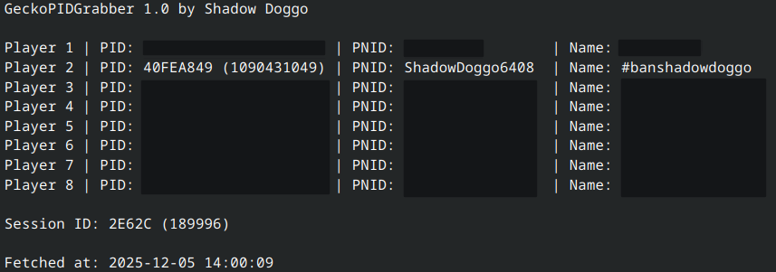

# GeckoPIDGrabber
PID/PNID grabber and match logger for Splatoon using TCPGecko.



To use run ```python /path/to/script/gecko_pid_grabber.py x.x.x.x``` where "x.x.x.x" is your Wii U's LAN IP address.

Additional arguments:

* ```log``` - Write full match log to file.

* ```silent``` - Enable silent logging (don't print logs to console).

* ```stats``` - Enable logging of player stats (points, kills, deaths, win/loss). Requires the match to complete to finish logging (also makes logging a lot slower).

* ```auto``` - Enable auto logging. When enabled will automatically log every match you play.

Notes:

* Python 3.10+ is required.

* This will likely only work with regular TCPGecko as I did not account for different memory offsets.

* Only one program can be connected to TCPGecko at a time.

* Stats might not always be 100% accurate, I'm not sure why.

## Credits
[pyGecko](https://github.com/wiiudev/pyGecko) authors - tcpgecko.py and common.py

Jerry and everyone who contributed to [PNIDGrab](https://github.com/JerrySM64/PNIDGrab) as this is partly based on it.
